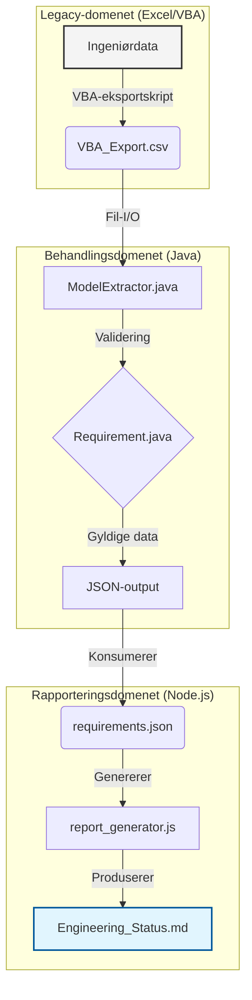

# BridgeFlow-MBSE

**BridgeFlow-MBSE** er et teknisk proof‑of‑concept som demonstrerer automatisert dataflyt for komplekse systems engineering‑prosjekter. Løsningen gir en digital bro mellom ustrukturerte legacy-data (Excel/VBA) og strukturerte modell-data ved hjelp av Java og moderne DevOps‑praksis.

 
---

## Funksjoner

- Import av legacy-ingeniørdata via VBA og CSV
- Java-basert validerings- og transformasjonsmotor
- JSON som mellomformat for datautveksling
- Automatisk Markdown‑rapportering med Node.js
- Modulær arkitektur for utvidbarhet og gjenbruk

## Arkitektur

Pipelinen består av tre uavhengige domener:



Hver komponent har et klart definert ansvar, noe som gjør det mulig å bytte implementasjoner (f.eks. CSV → REST‑API) uten å påvirke etterfølgende logikk.

## Prosjektstruktur

```
legacy_excel/       # Excel-arbeidsbok og VBA-eksportskript
output/             # Genererte JSON- og Markdown-rapporter
scripts/            # Node.js-rapportgenerator
src/                # Java-kildekode
README.md           # Prosjektdokumentasjon
run_pipeline.bat    # Hjælpeskript for Windows
```

## Forutsetninger

- **Java JDK 11+** installert og på `PATH`
- **Node.js 14+** (for rapportgeneratoren)
- Valgfritt: Git for versjonskontroll

## Kjøring av pipelinen

### Automatisk (Windows)

Dobbeltklikk `run_pipeline.bat` eller kjør:

```powershell
.\run_pipeline.bat
```

### Manuelle steg

```bash
# kompiler Java
javac src/*.java

# transformer legacy CSV til JSON
java -cp src ModelExtractor

# generer Markdown-rapport
node scripts/report_generator.js
```

Resultatfilene finner du i `output/`.

## Designfilosofi

- **Modularitet:** Hvert trinn kan erstattes eller utvides uavhengig.
- **Skalerbarhet:** Java‑motoren er laget for integrasjon med MBSE‑verktøy som Cameo Systems Modeler eller 3DExperience.
- **Sporbarhet:** Digital‑thread tilnærming sikrer at hvert krav er sporbart fra kilde til rapport og reduserer manuelle feil.
