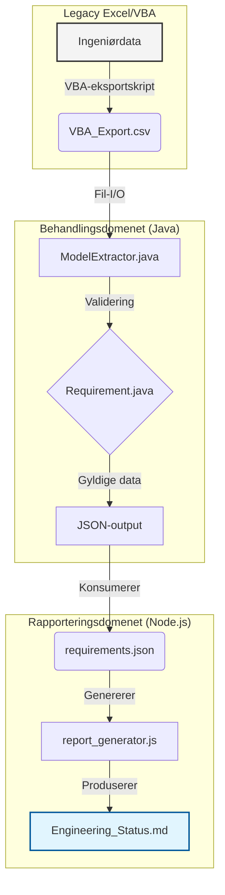

# BridgeFlow-MBSE

**BridgeFlow-MBSE** er et avansert *Proof of Concept* (PoC) som demonstrerer en moderne **Digital Thread** i komplekse ingeniørprosjekter. Verktøyet automatiserer overgangen fra eldre VBA/Exceldata til strukturerte systemmodeller som kan brukes i verktøy som Cameo Systems Modeler og 3DExperience.


---

## Innhold

1. [Formål](#formål)
2. [Tekniske funksjoner](#tekniske-funksjoner)
3. [Arkitektur](#arkitektur)
4. [Prosjektstruktur](#prosjektstruktur)
5. [Forutsetninger](#forutsetninger)
6. [Installasjon og kjøring](#installasjon-og-kjøring)
7. [Relevans for Systems Engineering](#relevans-for-systems-engineering)
8. [Designfilosofi](#designfilosofi)

## Formål

Store utviklingsprosjekter har ofte verdifulle data låst i eldre Excelark og VBAskript. BridgeFlow fungerer som en bro som:

- Ekstraherer data fra legacy VBAeksporter
- Validerer krav med Javabasert forretningslogikk
- Utfører arkitektonisk risikoanalyse (Safety Verification)
- Distribuerer resultater til dashboards (HTML) og industristandarder (ReqIF)

## Tekniske funksjoner

### Javabasert modellmotor

- Objektorientert arkitektur med Component og Requirementklasser
- Safety Verificationmotor for å flagge manglende sikkerhetskrav
- Multiformat eksportør (JSON, ReqIF)

### DevOps & pipeline

- Batchscript (`run_pipeline.bat`) som håndterer hele flyten
- Tidsstemplede logger i logs/pipeline.log
- GitHub ActionsCI for automatisk validering

### Profesjonell rapportering

- Node.jsbasert dashboardgenerator med CSSanimasjoner
- Digital traceability mellom krav, komponent og status

## Arkitektur

Pipelinen består av tre domener:


Hver komponent er isolert, noe som gjør det enkelt å bytte for eksempel CSV‑input med et REST‑API uten å endre logikken som følger.

## Prosjektstruktur

```
├── src/                    # Java kildekode (Modell-logikk)
│   ├── ModelExtractor.java  # Hovedmotor og eksportør
│   ├── Requirement.java     # Datamodell for krav
│   └── Component.java       # Datamodell for systemkomponenter
├── scripts/                # Rapporteringsverktøy
│   ├── report_generator.js  # Node.js generator
│   └── style.css            # Profesjonell dashboard-styling
├── legacy_excel/           # Input-mappe for VBA-eksporter (.csv)
├── output/                 # Genererte filer (HTML, ReqIF, Markdown)
├── logs/                   # Audit-logger for DevOps-sporbarhet
├── run_pipeline.bat        # "One-click" automatiseringsskript
└── README.md               # Systemdokumentasjon
```
## Forutsetninger

- Java JDK17+ på PATH
- Node.js14+ (for rapportgenerator)
- Valgfritt: Git

## Installasjon og kjøring

1. Klon repo:
   ```bash
   git clone https://github.com/Kefmat/bridgeflow-mbse-automation.git
   ```
2. Start pipelinen:
   ```bash
   .\run_pipeline.bat
   ```
3. Resultater:
   - Åpne output/dashboard.html i nettleser
   - Importer output/requirements.reqif i Cameo/3DExperience

## Relevans for Systems Engineering

- Tilrettelegger for vedlikehold av legacyskript
- Demonstrerer Javapluginlogikk for MBSE
- ReqIFintegrasjon og digital sporbarhet
- Automatiserer manuelt arbeid med DevOpsmetodikk

## Designfilosofi

- **Modulær:** Delene kan byttes uavhengig
- **Skalerbar:** Bygd for integrasjon med MBSEverktøy
- **Sporbar:** Hver kravlinje kan spores fra kilde til rapport
