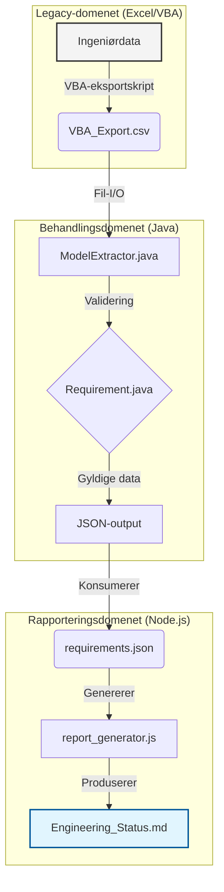

# BridgeFlow-MBSE

**BridgeFlow-MBSE** er et avansert "Proof of Concept" (PoC) utviklet for å demonstrere en moderne Digital Thread i komplekse ingeniørprosjekter. Verktøyet automatiserer overgangen fra legacy-formater (VBA/Excel) til strukturerte systemmodeller som kan brukes i verktøy som Cameo Systems Modeler og 3DExperience.


 
---

## Prosjektets Formål
I store utviklingsprosjekter ligger ofte verdifulle data fanget i eldre Excel-ark og VBA-skript. BridgeFlow fungerer som en bro som:

1. Ekstraherer data fra legacy VBA-eksporter.

2. Validerer tekniske krav ved hjelp av en Java-basert forretningslogikk.

3. Analyserer arkitektonisk risiko (Safety Verification).

4. Distribuerer data til dashboards (HTML) og industristandarder (ReqIF).

## Tekniske Funksjoner

1. Java-basert Modellmotor (System Core)
Hjertet av systemet er skrevet i Java for å simulere en custom plugin.

- Objektorientert arkitektur: Bruker Component og Requirement klasser for å bygge relasjonelle modeller.

- Safety Verification: En innebygd analyse-motor som flagger Hardware-komponenter som mangler kritiske sikkerhetskrav (Safety Constraints).

- Multi-format Eksportør: Genererer både JSON for web-bruk og ReqIF for systemintegrasjon.

2. DevOps & Pipeline Automatisering

- Automatisert Workflow: Et batch-script (run_pipeline.bat) som håndterer hele flyten fra kompilering til rapportåpning.

- Audit Logging: Full sporbarhet gjennom tidsstemplede logger i /logs/pipeline.log.

- GitHub Actions: CI/CD-oppsett som validerer koden ved hver "push".

3. Profesjonell Rapportering
- Dynamic Dashboard: Node.js-generator som produserer et visuelt HTML5-dashboard med CSS3-animasjoner.

- Digital Traceability: Dashboardet viser koblingen mellom ID, kravbeskrivelse, systemkomponent og sikkerhetsstatus.

## Arkitektur

Pipelinen består av tre uavhengige domener:



Hver komponent har et klart definert ansvar, noe som gjør det mulig å bytte implementasjoner (f.eks. CSV → REST‑API) uten å påvirke etterfølgende logikk.

## Prosjektstruktur

```
├── src/                    # Java kildekode (Modell-logikk)
│   ├── ModelExtractor.java  # Hovedmotor og eksportør
│   ├── Requirement.java     # Datamodell for krav
│   └── Component.java       # Datamodell for systemkomponenter
├── scripts/                # Rapporteringsverktøy
│   ├── report_generator.js  # Node.js generator
│   └── style.css            # Profesjonell dashboard-styling
├── legacy_excel/           # Input-mappe for VBA-eksporter (.csv)
├── output/                 # Genererte filer (HTML, ReqIF, Markdown)
├── logs/                   # Audit-logger for DevOps-sporbarhet
├── run_pipeline.bat        # "One-click" automatiseringsskript
└── README.md               # Systemdokumentasjon
```

## Forutsetninger

- **Java JDK 17+** installert og på `PATH`
- **Node.js 14+** (for rapportgeneratoren)
- Valgfritt: Git for versjonskontroll

### Installasjon og kjøring
1. Klon arkivet:
\`\`\`bash
git clone https://github.com/DITT-BRUKERNAVN/BridgeFlow-MBSE.git
\`\`\`

2. Kjør hele pipelinen:
\`\`\`bash
.\run_pipeline.bat
\`\`\`

3. Se resultatet:

- Dashboard: Åpne output/dashboard.html i nettleseren.

- ReqIF: Finn output/requirements.reqif for import i Cameo/3DExperience.


## Relevans for Systems Engineering
Dette prosjektet demonstrerer direkte kompetanse innen:

- Vedlikehold av komplekse skript: Brobygging mellom VBA og moderne språk.

- Utvikling av Java-plugins: Logikk som kan overføres til Cameo/No Magic rammeverk.

- ReqIF-integrasjon: Forståelse for industriens standardformater for kravutveksling.

- Automatisering: Reduksjon av manuelt arbeid for systemingeniører gjennom DevOps-metodikk.


## Designfilosofi

- **Modularitet:** Hvert trinn kan erstattes eller utvides uavhengig.
- **Skalerbarhet:** Java‑motoren er laget for integrasjon med MBSE‑verktøy som Cameo Systems Modeler eller 3DExperience.
- **Sporbarhet:** Digital‑thread tilnærming sikrer at hvert krav er sporbart fra kilde til rapport og reduserer manuelle feil.
